<p align="center">
  
</p>

<p align="center">
  An AI-native business intelligence backend for schema embedding, natural-language analytics, automated reporting, planning, and strategic validation.
</p>

<p align="center">
  
    
  
  
  
  
  
  
  
  
  
  
  
</p>

---

## Table Of Contents

- [Project Overview](#project-overview)
- [Key Features](#key-features)
- [Demos And Screenshots](#demos-and-screenshots)
- [Complete Architecture](#complete-architecture)
- [Feature Deep Dives](#feature-deep-dives)
- [AI Pipeline](#ai-pipeline)
- [API Documentation](#api-documentation)
- [Folder Structure](#folder-structure)
- [Technology Stack](#technology-stack)
- [Environment Variables](#environment-variables)
- [Installation](#installation)
- [Running The Project](#running-the-project)
- [Docker Architecture](#docker-architecture)
- [Configuration](#configuration)
- [Project Workflow](#project-workflow)
- [Performance Considerations](#performance-considerations)
- [Security](#security)
- [Scalability](#scalability)
- [Design Patterns Used](#design-patterns-used)
- [Future Improvements](#future-improvements)
- [Contributing](#contributing)
- [License](#license)
- [Authors](#authors)
- [Acknowledgments](#acknowledgments)

## Project Overview

RecoMind AI is a collection of Python backend services that turn company data and business text into operational intelligence. The repository is organized as five independent FastAPI services under `src/`:

- `src/data_embedding`: scans a company's SQL Server database, describes table schemas with an LLM, embeds those descriptions, and stores them in PostgreSQL with pgvector.
- `src/copilot`: answers natural-language business questions by combining RBAC table permissions, vector table search, schema lookup, SQL generation, direct SQL execution, and response formatting.
- `src/reporting_system`: generates full analytical reports from a natural-language request using CrewAI for data collection and LangGraph for dataframe analysis.
- `src/planning_board`: converts a strategic plan into modules, tasks, dates, dependencies, priorities, and suggested employee owners.
- `src/validition`: validates a strategic decision through strategy structuring, precedent analysis, resource simulation, market trend analysis, and final report generation. The directory name is spelled `validition` in the repository.

Traditional BI tools usually require manual schema understanding, dashboard design, SQL authoring, and analyst interpretation. RecoMind AI moves more of that work into AI-assisted backend pipelines. The embedding service gives the system semantic memory of a company's database. The copilot and reporting services use that memory to select relevant tables and produce SQL-backed answers. Planning and validation extend the same AI-backed operating model from analysis into execution planning and decision support.

The business value is shorter time-to-insight, less dependency on manual SQL work, repeatable reporting workflows, and a clearer bridge between company data, team structure, and strategic decisions.

## Key Features

| Feature | Purpose | Main Technologies | Current Status |
| --- | --- | --- | --- |
| Data Embedding | Build searchable database-schema memory per company | FastAPI, Celery, Redis, SQL Server, PostgreSQL, pgvector, SentenceTransformers, OpenRouter | Implemented |
| AI Copilot | Answer natural-language questions against company databases | FastAPI, CrewAI, SQL Server, pgvector, Redis, Celery, pandas | Implemented |
| Reporting System | Generate asynchronous analytical reports | FastAPI, Celery, Redis, CrewAI, LangGraph, pandas, SQL Server | Implemented |
| Planning Board | Transform strategy text into executable team plans | FastAPI, OpenRouter, Celery, Redis, httpx, Pydantic | Implemented |
| Validation | Validate strategic plans with precedent, resources, market trends, and reports | FastAPI, CrewAI, OpenRouter, Serper search, Celery, Redis, httpx | Implemented |
| Mock API Support | Return static payloads for .NET backend integration tests | FastAPI routers | Implemented for planning and validation |
| Dockerized Workers | Run APIs and queue workers independently | Docker, Docker Compose, Redis, Celery | Implemented per service |

## Demos And Screenshots

Full recorded demos are available in the shared Google Drive folder:

[Open RecoMind AI demos](https://drive.google.com/drive/folders/1FFEtBQVpKbs3HIBocXwBWs4EEAlrLvt2)

### AI Copilot

| Conversation | Query Result | Follow-up |
| --- | --- | --- |
|  |  |  |

### Reporting System

| Report Request | Analysis Output | Generated Insights |
| --- | --- | --- |
| 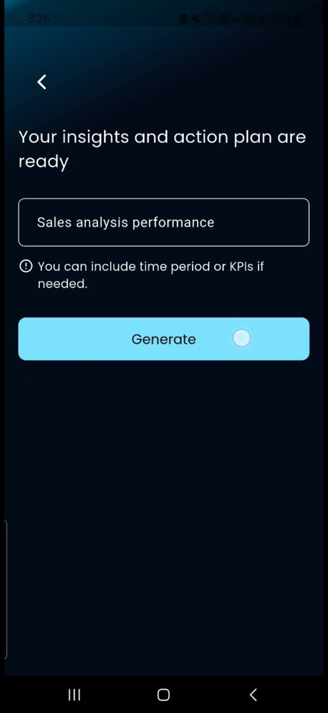 | 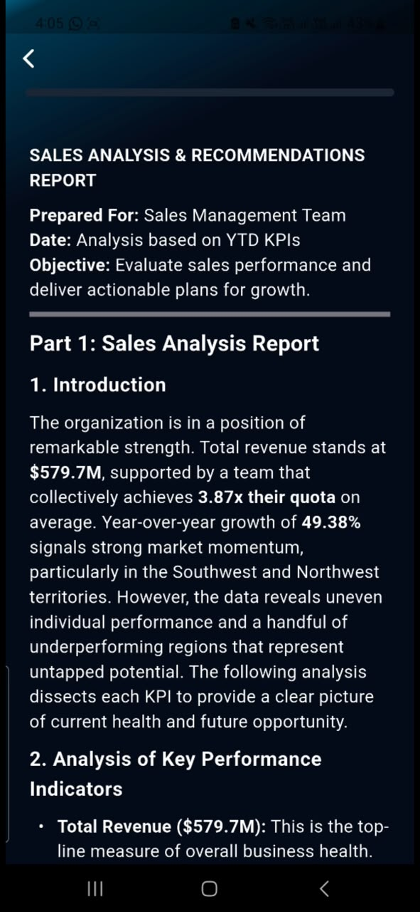 | 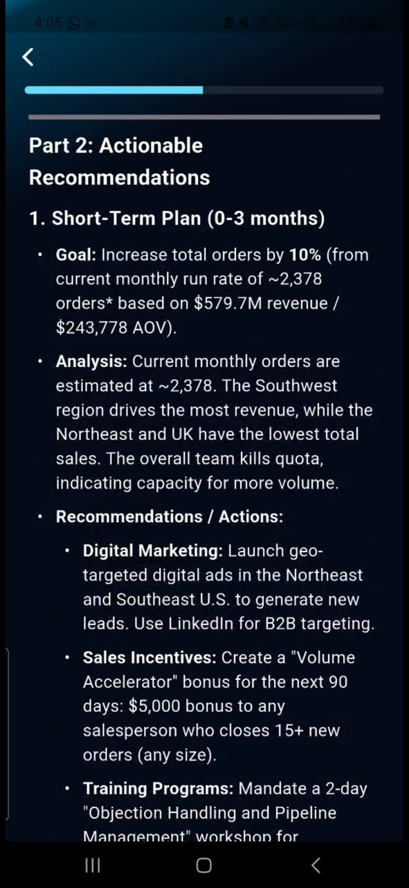 |

### Planning Board

| Plan Input | Generated Tasks | Task Details |
| --- | --- | --- |
|  |  |  |

### Validation

| Validation Request | Engine Results | Final Report |
| --- | --- | --- |
| 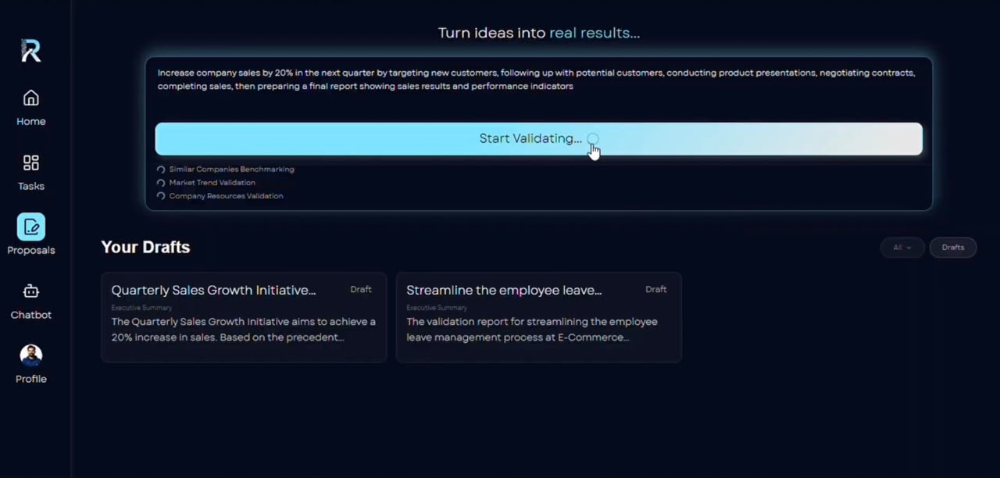 | 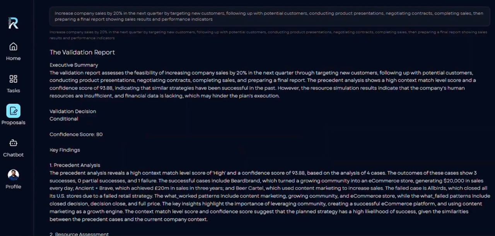 | 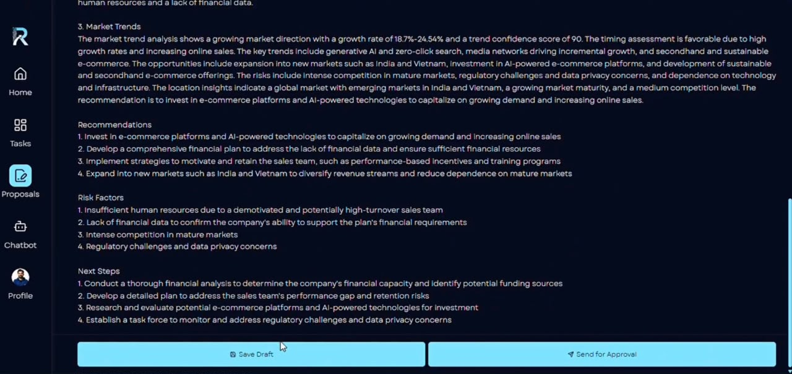 |

## Complete Architecture

RecoMind AI is a service-oriented backend. Each feature owns its application, configuration, Dockerfile, queue worker, and request models. The shared runtime pattern is:

1. FastAPI receives a synchronous or asynchronous request.
2. Long-running work is sent to Celery.
3. Redis acts as broker and result backend.
4. AI services call OpenRouter-compatible LLM endpoints.
5. SQL Server is used as the tenant source database.
6. PostgreSQL with pgvector stores schema embeddings and team table assignments.
7. External .NET APIs provide company, team, employee, report, and DB settings data.

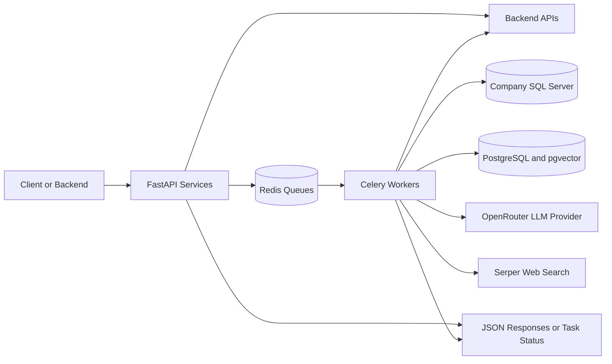

### Request Flow

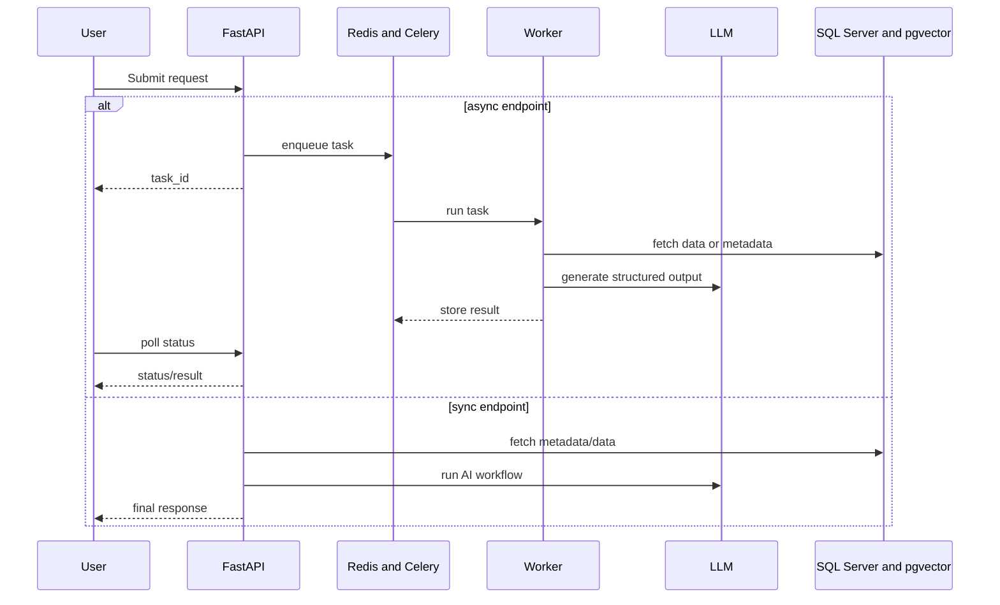

### Background Workers

| Service | Queue | Worker Module | Default Redis URL |
| --- | --- | --- | --- |
| Reporting | `reporting_queue` | `src/reporting_system/celery_worker.py` | `redis://localhost:6379/0` |
| Copilot | `copilot_queue` | `src/copilot/celery_worker.py` | `redis://localhost:6379/0` |
| Embedding | `embedding_queue` | `src/data_embedding/tasks/celery_app.py` | `CELERY_BROKER_URL` |
| Planning Board | `planning_board_queue` | `src/planning_board/workers/celery_app.py` | `redis://planning-board-redis:6379/0` |
| Validation | `validation_queue` | `src/validition/workers/celery_app.py` | `redis://validation-redis:6379/0` |

## Feature Deep Dives

### Data Embedding

#### Purpose

The embedding service prepares the semantic database memory used by downstream AI features. It scans a company's SQL Server schema, produces business-friendly table descriptions, embeds those descriptions, saves them to PostgreSQL with pgvector, and assigns database tables to teams.

#### Business Value

Natural-language analytics works only when the AI understands the company's schema. This service converts raw table and column metadata into searchable business context, reducing repeated schema discovery and enabling RBAC-aware table selection in the copilot.

#### User Workflow

1. A client calls `POST /start-pipeline` with `company_id`.
2. The API submits `run_ingestion_pipeline_task` to Celery.
3. The client polls `GET /task-status/{task_id}`.
4. The final result reports pipeline success or failure for the company.

#### Internal Workflow

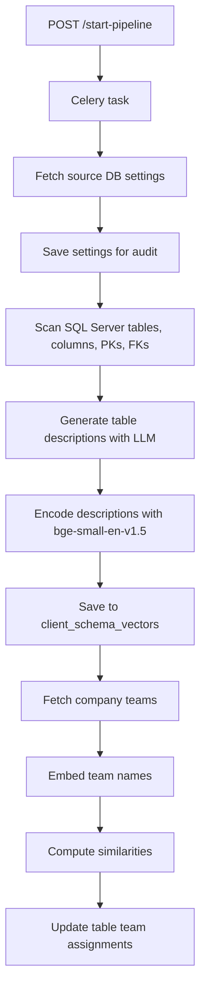

Important modules:

- `app/main.py`: FastAPI application mounted under `/embedding`.
- `app/routes/pipeline_routes.py`: task submission, task polling, and health endpoints.
- `tasks/pipeline_tasks.py`: Celery wrapper around the ingestion pipeline.
- `core/ingestion_pipeline.py`: seven-step orchestration function.
- `core/database_scanner.py`: uses SQL Server system views and `INFORMATION_SCHEMA` to collect tables, columns, primary keys, and foreign keys.
- `core/services/description_generator.py`: batches table schemas and asks the LLM for business descriptions.
- `core/services/embedding_service.py`: loads `BAAI/bge-small-en-v1.5` through SentenceTransformers.
- `core/repositories/vector_repository.py`: writes embeddings to `client_schema_vectors`, clears old company rows before insertion, reads table embeddings, and updates `team_name` assignments.
- `core/teams/manager.py`: coordinates team embeddings, similarity scoring, and table assignment.

#### Outputs

The core persistent output is the `client_schema_vectors` table in the vector database. Records include `company_id`, `table_name`, `table_description`, `table_relations`, `embedding`, and team assignment data. An audit insert is attempted in `team_assignment_audit` when confidence scores are available.

### AI Copilot

#### Purpose

The copilot answers business questions in natural language by generating SQL against a company's source database and formatting the result into a user-friendly answer.

#### Business Value

The copilot makes operational data accessible to non-SQL users while preserving team-level table access through RBAC filtering. It is designed for concise metric answers such as totals, counts, averages, and date-aware business questions.

#### User Workflow

1. A client sends `company_id`, `team_name`, and `user_question`.
2. The system fetches the company's database settings from metadata storage.
3. CrewAI agents understand intent, select allowed tables, fetch schemas, and generate SQL.
4. The service executes the SQL directly.
5. A final AI formatting step returns a contextual answer.

#### Internal Workflow

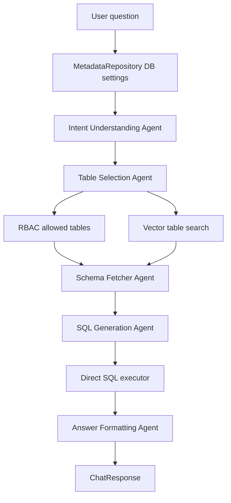

Important modules:

- `main.py`: FastAPI app with `/chat/async` and `/chat/status/{task_id}` endpoints.
- `api/routes.py`: synchronous `/chat`, `/health`, and root endpoints.
- `services/chat_service.py`: high-level service factory and error normalization.
- `services/crew_service.py`: CrewAI orchestration. SQL execution is deliberately outside the CrewAI agent loop.
- `agents/definitions.py`: five agents: intent understanding, table selection, schema fetching, SQL generation, and answer formatting.
- `tasks/definitions.py`: prompt and context chain for the five tasks.
- `tools/rbac_tool.py`: reads `client_schema_vectors.team_name` to restrict tables by team.
- `tools/vector_search_tool.py`: embeds the query key, searches pgvector, and applies keyword boosts for common domains such as revenue, sales, customer, product, and employee.
- `services/sql_executor.py`: enforces `SELECT`-only queries and blocks write or DDL keywords before running SQL Server queries through `pyodbc`.

#### Outputs

The synchronous and asynchronous endpoints both return a `success`, `answer`, and `error` structure when complete.

### Reporting System

#### Purpose

The reporting system creates longer-form analytical reports from company data. It combines a CrewAI SQL-generation phase with a LangGraph dataframe-analysis phase.

#### Business Value

Instead of asking analysts to manually choose tables, write SQL, export data, calculate KPIs, and write findings, this service automates that lifecycle behind a task queue. It is suitable for report-style requests such as employee performance analysis and sales analysis.

#### User Workflow

1. A client calls `POST /run_analysis`.
2. The API enqueues `run_full_pipeline`.
3. The worker updates progress through stage messages.
4. The client polls `GET /get_status/{task_id}`.
5. The final task result is a generated report string.

#### Internal Workflow

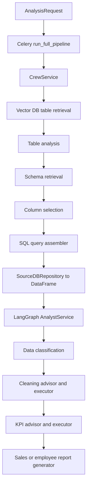

Important modules:

- `api/routes.py`: task submission, status polling, and health.
- `pipeline.py`: Celery task entry point.
- `services/pipeline_service.py`: orchestrates three stages: CrewAI data collection, source DB query execution, and LangGraph report generation.
- `services/crew_service.py`: fetches source DB settings, configures vector/schema/SQL tools, and runs a five-agent CrewAI process.
- `analyst/workflow.py`: compiles the LangGraph `StateGraph`.
- `analyst/steps/`: classifier, cleaning, KPI, and reporting nodes.
- `services/analyst_service.py`: invokes the compiled graph and returns `analysis_report`.

#### LangGraph Analysis Flow

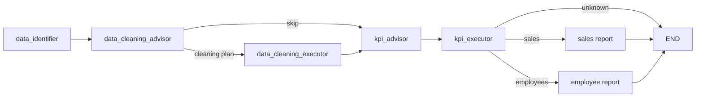

### Planning Board

#### Purpose

The planning board service converts free-form strategic plan text into a structured execution plan with modules, tasks, owners, dates, dependencies, priorities, and a timeline.

#### Business Value

Strategic plans often fail at the handoff from idea to execution. This service creates a first draft of work decomposition and role assignment using real team employees from the .NET backend.

#### User Workflow

1. Client sends `company_id`, `team_id`, and `plan_text`.
2. API key dependency validates the request.
3. The service fetches team employees from the .NET API.
4. LLM parsing turns the plan text into modules and tasks.
5. LLM role matching assigns tasks to employees.
6. Dates and timeline phases are calculated.
7. The response is returned directly or through async task polling.

#### Internal Workflow

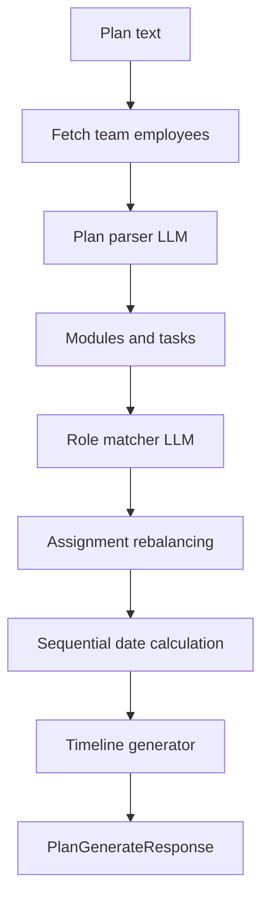

Important modules:

- `main.py`: FastAPI app under `/planning_board` with `/health`.
- `api/routes.py`: `/plans/generate`, `/plans/generate/async`, `/plans/status/{task_id}`, `/health`, and mock endpoints.
- `services/plan_generator.py`: main orchestrator.
- `services/employee_service.py`: calls the .NET team employees endpoint and normalizes several response shapes.
- `services/plan_parser.py`: LLM-backed parsing service.
- `services/assignment_engine.py`: applies role matches to tasks.
- `services/role_matcher.py`: batch LLM matching plus workload rebalancing and keyword fallback.
- `services/timeline_generator.py`: sequential phase and task timeline generation.
- `workers/tasks.py`: Celery wrapper with progress states.

### Validation

#### Purpose

The validation service assesses a strategic plan or business decision before execution. It combines company context, historical reports, precedent cases, resource readiness, market trend signals, and a final validation report.

#### Business Value

The service gives stakeholders a structured pre-execution view: whether similar strategies worked elsewhere, whether internal resources look sufficient, whether market timing is favorable, and what risks or next steps should be considered.

#### User Workflow

1. Client sends `company_id`, `team_id`, and `user_request`.
2. API key dependency validates the request.
3. The synchronous `/validate` endpoint dispatches a Celery task and polls for up to 10 minutes.
4. The async `/validate/async` endpoint returns a task id immediately.
5. The client can poll `/validate/status/{task_id}`.

#### Internal Workflow

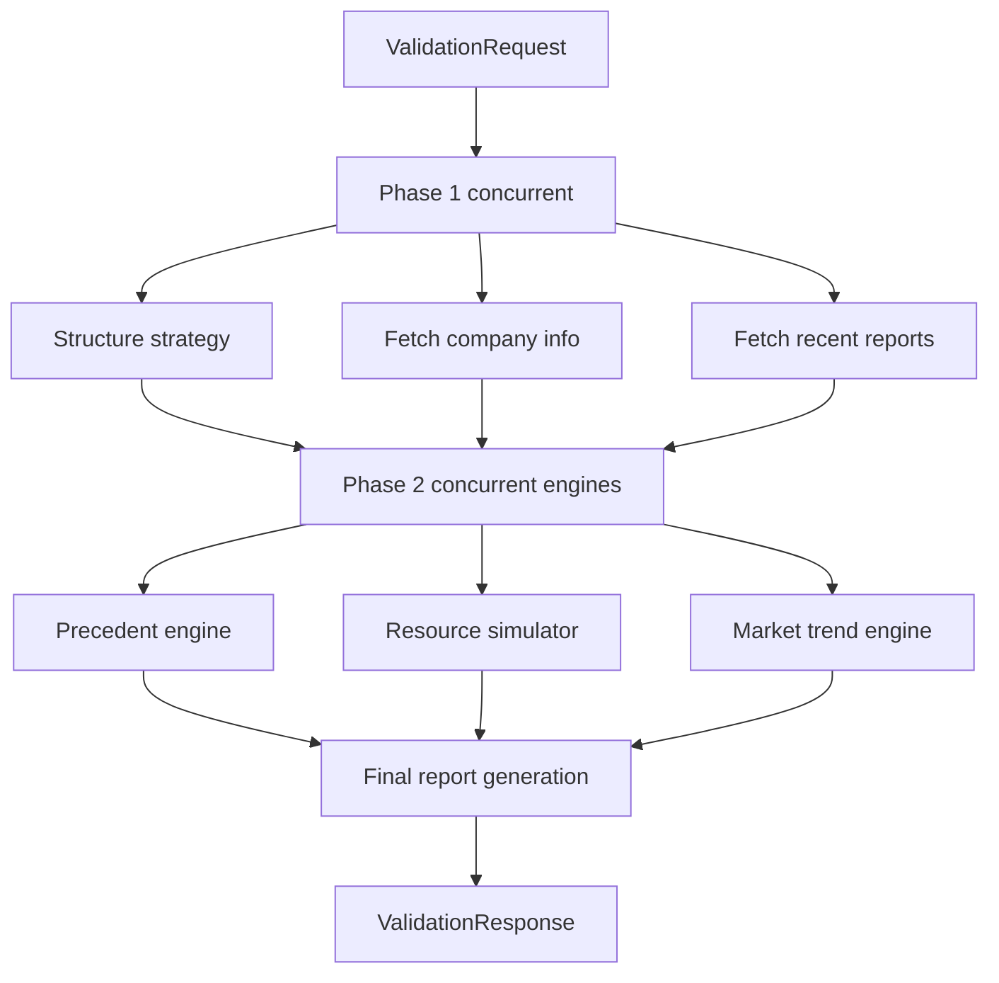

Important modules:

- `api/routes.py`: `/validate`, `/validate/async`, `/validate/status/{task_id}`, `/health`, and mock endpoints.
- `services/validation_pipeline.py`: three-phase async orchestration.
- `services/strategy_structuring/service.py`: CrewAI agent that transforms raw strategy text into structured inputs for later engines.
- `services/precedent_engine/service.py`: generates search queries, searches and enriches results, extracts business cases, retries if too few or one-sided cases are found, and builds a precedent summary.
- `services/resource_simulator/service.py`: compares plan requirements against company information and recent reports.
- `services/market_trend_engine/service.py`: builds market queries, searches, ranks, and asks an LLM for trend analysis.
- `services/report_generation/service.py`: combines all engine outputs into a final decision, confidence score, findings, recommendations, risks, and next steps.
- `clients/`: retrieves authentication, company data, and reports from external APIs.
- `tools/search_tools.py`: search, enrichment, deduplication, ranking, and context construction for precedent and market engines.

## AI Pipeline

### Embeddings And Vector Search

RecoMind uses `BAAI/bge-small-en-v1.5` through SentenceTransformers in both ingestion and search paths. During ingestion, table descriptions are embedded and stored in PostgreSQL with pgvector. During copilot and reporting requests, a query or query key is embedded and compared against stored table embeddings.

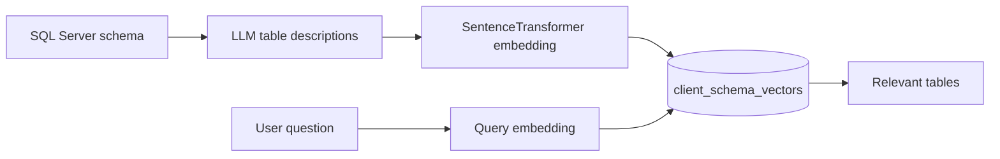

### Prompt Engineering

Prompting is implemented as Python modules and task descriptions rather than external prompt files:

- Copilot prompts live in `src/copilot/agents/prompts/`.
- Reporting CrewAI prompts live in `src/reporting_system/agents/definitions.py` and `src/reporting_system/tasks/definitions.py`.
- Planning prompts live in `src/planning_board/llm/prompts.py`.
- Validation prompts are grouped by engine under `src/validition/services/*/prompts.py`.

### Agents, Crews, And Graphs

- CrewAI is used for role-specialized LLM workflows in copilot, reporting SQL collection, planning role matching, strategy structuring, precedent extraction, market trend analysis, and report generation.
- LangGraph is used in the reporting system for deterministic dataframe analysis routing after SQL data is fetched.
- The code does not implement long-term conversational memory; persistent semantic memory is schema-level memory in the vector database.

## API Documentation

### Data Embedding API

Base app root path: `/embedding`

| Method | Endpoint | Purpose | Request | Response |
| --- | --- | --- | --- | --- |
| `POST` | `/start-pipeline` | Start schema ingestion and team assignment | `{ "company_id": "..." }` | `task_id`, `status`, `message`, `company_id` |
| `GET` | `/task-status/{task_id}` | Poll ingestion task | Path `task_id` | `task_id`, `status`, `result` |
| `GET` | `/health` | Health check | None | `status`, `service` |

### Copilot API

Base app root path: `/copilot`

| Method | Endpoint | Purpose | Request | Response |
| --- | --- | --- | --- | --- |
| `POST` | `/chat` | Process a natural-language question synchronously | `company_id`, `team_name`, `user_question` | `success`, `answer`, `error` |
| `POST` | `/chat/async` | Submit a chat question to Celery | `company_id`, `team_name`, `user_question` | `task_id`, `status`, `message` |
| `GET` | `/chat/status/{task_id}` | Poll async chat task | Path `task_id` | `task_id`, `status`, `result` |
| `GET` | `/health` | Health check | None | `status`, `version` |
| `GET` | `/` | Service metadata | None | `name`, `version`, `docs`, `health` |

### Reporting System API

Base app root path: `/reporting`

| Method | Endpoint | Purpose | Request | Response |
| --- | --- | --- | --- | --- |
| `POST` | `/run_analysis` | Submit report generation task | `company_id`, `user_request`, optional `team_name` | `task_id`, `status`, `message` |
| `GET` | `/get_status/{task_id}` | Poll report task | Path `task_id` | `task_id`, `status`, `result` |
| `GET` | `/health` | Health check | None | `status` |

### Planning Board API

Base app root path: `/planning_board`; API prefix: `/api/v1`

| Method | Endpoint | Purpose | Request | Response |
| --- | --- | --- | --- | --- |
| `POST` | `/api/v1/plans/generate` | Generate a full plan synchronously | `company_id`, `team_id`, `plan_text` | `PlanGenerateResponse` |
| `POST` | `/api/v1/plans/generate/async` | Submit plan generation task | `company_id`, `team_id`, `plan_text` | `task_id`, `status`, `message` |
| `GET` | `/api/v1/plans/status/{task_id}` | Poll plan generation | Path `task_id` | `task_id`, `status`, `progress`, `result`, `error` |
| `GET` | `/api/v1/health` | Service health | None | `status`, `service` |
| `GET` | `/health` | App-level health | None | `status`, `app`, `env` |
| `GET` | `/api/v1/mock/...` | Static mock responses for backend tests | Varies | Static test payloads |

### Validation API

Base app root path: `/validation`; API prefix: `/api/v1`

| Method | Endpoint | Purpose | Request | Response |
| --- | --- | --- | --- | --- |
| `POST` | `/api/v1/validate` | Run validation via Celery and wait for result | `company_id`, `team_id`, `user_request` | `ValidationResponse` |
| `POST` | `/api/v1/validate/async` | Submit validation task | `company_id`, `team_id`, `user_request` | `task_id`, `status`, `message` |
| `GET` | `/api/v1/validate/status/{task_id}` | Poll validation task | Path `task_id` | `task_id`, `status`, `progress`, `result`, `error` |
| `GET` | `/api/v1/health` | Service health | None | `status`, `service` |
| `GET` | `/health` | App-level health | None | `status`, `app`, `env` |
| `GET` | `/api/v1/mock/...` | Static mock responses for backend tests | Varies | Static validation payload |

## Folder Structure

```text
RecoMind/
+-- README.md
+-- LICENSE
+-- data_examples/
|   +-- Employees.csv
|   +-- Sales.csv
|   +-- Sales2.csv
+-- final_output/
|   +-- sample generated reports
+-- final_output_ex/
|   +-- additional cleaned data and report outputs
+-- src/
    +-- copilot/
    |   +-- agents/
    |   +-- api/
    |   +-- config/
    |   +-- repositories/
    |   +-- services/
    |   +-- tasks/
    |   +-- tools/
    |   +-- utils/
    |   +-- Dockerfile
    |   +-- docker-compose.yml
    +-- data_embedding/
    |   +-- app/
    |   +-- clients/
    |   +-- config/
    |   +-- core/
    |   +-- tasks/
    |   +-- tests/
    |   +-- Dockerfile
    |   +-- docker-compose.yml
    +-- planning_board/
    |   +-- api/
    |   +-- core/
    |   +-- llm/
    |   +-- models/
    |   +-- services/
    |   +-- tests/
    |   +-- utils/
    |   +-- workers/
    |   +-- Dockerfile
    |   +-- docker-compose.yml
    |   +-- docker-compose.prod.yml
    +-- reporting_system/
    |   +-- agents/
    |   +-- analyst/
    |   +-- api/
    |   +-- config/
    |   +-- repositories/
    |   +-- services/
    |   +-- tasks/
    |   +-- tools/
    |   +-- utils/
    |   +-- Dockerfile
    |   +-- docker-compose.yml
    +-- validition/
        +-- api/
        +-- clients/
        +-- core/
        +-- llm/
        +-- models/
        +-- services/
        +-- tests/
        +-- tools/
        +-- utils/
        +-- workers/
        +-- Dockerfile
        +-- docker-compose.yml
        +-- docker-compose.prod.yml
```

## Technology Stack

### Backend

| Area | Technologies |
| --- | --- |
| API framework | FastAPI, Uvicorn |
| Data models | Pydantic, Pydantic Settings |
| Async HTTP | httpx, aiohttp |
| Logging | Python logging, Loguru |
| Testing | pytest, pytest-asyncio, pytest-cov |

### AI

| Area | Technologies |
| --- | --- |
| Agent orchestration | CrewAI |
| Graph workflows | LangGraph |
| LLM routing | OpenRouter-compatible endpoints, LiteLLM, OpenAI SDK |
| Embeddings | SentenceTransformers, `BAAI/bge-small-en-v1.5` |
| Search-assisted validation | Serper API, Wikipedia enrichment in search tooling |

### Databases And Data

| Area | Technologies |
| --- | --- |
| Source databases | Microsoft SQL Server through `pyodbc` and ODBC Driver 17 |
| Metadata/vector database | PostgreSQL with pgvector |
| Database access | psycopg2, SQLAlchemy, pandas SQL reads |
| Data processing | pandas, numpy |

### Infrastructure

| Area | Technologies |
| --- | --- |
| Containers | Docker, Docker Compose |
| Background jobs | Celery |
| Broker/result backend | Redis |
| Production compose files | Planning Board and Validation include `docker-compose.prod.yml` |

## Environment Variables

Each service has its own `.env.example`. Copy only the files for the services you run.

### Common Variables

| Variable | Used By | Purpose |
| --- | --- | --- |
| `OPENROUTER_API_KEY` | all AI services | LLM provider API key |
| `BASE_URL` / `OPENROUTER_BASE_URL` | AI services | OpenRouter-compatible base URL |
| `CELERY_BROKER_URL` | all queued services | Redis broker URL |
| `CELERY_RESULT_BACKEND` | planning, validation | Redis result backend |
| `ALLOWED_ORIGINS` | API services | CORS origin allow-list |
| `ENVIRONMENT` / `APP_ENV` | API services | Development/production behavior |

### Vector And Source Data

| Variable | Used By | Purpose |
| --- | --- | --- |
| `VECTOR_DB_HOST` | embedding, copilot, reporting | PostgreSQL host |
| `VECTOR_DB_NAME` | embedding, copilot, reporting | PostgreSQL database |
| `VECTOR_DB_USER` | embedding, copilot, reporting | PostgreSQL user |
| `VECTOR_DB_PASSWORD` | embedding, copilot, reporting | PostgreSQL password |
| `VECTOR_DB_PORT` | copilot, reporting | PostgreSQL port |
| `API_DB_SETTINGS` | embedding | External endpoint for source DB settings |
| `API_TEAMS` | embedding | External endpoint for company teams |

### Planning Board

| Variable | Purpose |
| --- | --- |
| `SERVICE_API_KEY` | Shared secret checked by API dependency |
| `MODEL_NAME` | LLM model name |
| `DOTNET_TEAM_EMPLOYEES_URL_TEMPLATE` | Employee lookup URL with `{team_id}` and `{company_id}` |
| `DOTNET_API_TOKEN` | Optional bearer token for the .NET backend |
| `REQUEST_TIMEOUT` | External request timeout |

### Validation

| Variable | Purpose |
| --- | --- |
| `SERVICE_API_KEY` | Shared secret checked by API dependency |
| `OPENROUTER_MODEL` | LLM model name |
| `DOTNET_AUTH_ENDPOINT` | Authentication endpoint |
| `DOTNET_COMPANY_ENDPOINT` | Company lookup endpoint |
| `DOTNET_REPORTS_ENDPOINT` | Report lookup endpoint |
| `AUTH_EMAIL` / `AUTH_PASSWORD` | Credentials for backend authentication |
| `REPORT_LIMIT` | Number of reports to retrieve |
| `SERPER_API_KEY` | Search API key |
| `MIN_PRECEDENT_CASES` / `MAX_PRECEDENT_CASES` / `TARGET_PRECEDENT_CASES` | Precedent extraction controls |

## Installation

### Prerequisites

- Python 3.10 or 3.11 depending on service Dockerfile.
- Docker and Docker Compose for containerized execution.
- Redis when running Celery locally.
- Microsoft ODBC Driver 17 for SQL Server when running SQL Server integrations locally.
- PostgreSQL with pgvector and expected tables such as `client_schema_vectors`.
- Valid OpenRouter-compatible LLM credentials.
- External .NET backend endpoints when using company, team, report, or DB settings integrations.

### Clone

```bash
git clone <repository-url>
cd RecoMind
```

### Configure A Service

```bash
cd src/reporting_system
cp .env.example .env
# edit .env with real credentials
```

Repeat this pattern for `src/copilot`, `src/data_embedding`, `src/planning_board`, or `src/validition`.

### Manual Python Setup

Run commands from the target service directory:

```bash
python -m venv .venv
source .venv/bin/activate
pip install -r requirements.txt
```

## Running The Project

### Docker

Run one service stack at a time from its directory:

```bash
cd src/data_embedding
docker compose up --build
```

```bash
cd src/reporting_system
docker compose up --build
```

```bash
cd src/copilot
docker compose up --build
```

```bash
cd src/planning_board
docker compose up --build
```

```bash
cd src/validition
docker compose up --build
```

### Local API And Worker

Use two terminals per queued service: one for FastAPI and one for Celery.

Reporting:

```bash
cd src/reporting_system
uvicorn main:app --host 0.0.0.0 --port 8001 --reload
celery -A celery_worker.celery_app worker --loglevel=info -P gevent -Q reporting_queue
```

Copilot:

```bash
cd src/copilot
uvicorn main:app --host 0.0.0.0 --port 8002 --reload
celery -A celery_worker.celery_app worker --loglevel=info -P gevent -Q copilot_queue
```

Embedding:

```bash
cd src/data_embedding
uvicorn app.main:app --host 0.0.0.0 --port 8000 --reload
celery -A tasks.celery_app.celery_app worker --loglevel=info -P gevent -Q embedding_queue
```

Planning Board:

```bash
cd src/planning_board
uvicorn main:app --host 0.0.0.0 --port 8003 --reload
celery -A workers.celery_app worker --loglevel=info -Q planning_board_queue
```

Validation:

```bash
cd src/validition
uvicorn main:app --host 0.0.0.0 --port 8004 --reload
celery -A workers.celery_app worker --loglevel=info -Q validation_queue
```

### Default Ports

| Service | API Port | Redis Host Port In Compose |
| --- | --- | --- |
| Data Embedding | `8000` | `6379` |
| Reporting System | `8001` | `6379` |
| Copilot | `8002` | `6380` |
| Planning Board | `8003` | `6381` |
| Validation | `8004` | `6382` |

## Docker Architecture

Each service compose file follows the same model:

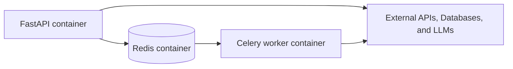

Service-specific notes:

- Reporting and copilot Dockerfiles install Microsoft ODBC Driver 17 for SQL Server.
- Embedding uses Python 3.10 slim and installs SQL Server ODBC dependencies.
- Planning and validation include health checks on `/health`.
- Planning and validation include production compose files with Redis memory policy and restart settings.

## Configuration

The repository uses environment-driven configuration. Reporting, copilot, and embedding use module-level settings loaded with `python-dotenv`. Planning and validation use `pydantic-settings` classes with typed defaults.

Configuration files to review:

- `src/reporting_system/config/settings.py`
- `src/copilot/config/settings.py`
- `src/data_embedding/config/settings.py`
- `src/planning_board/core/config.py`
- `src/validition/core/config.py`

## Project Workflow

The intended operational order is:

1. Run the embedding pipeline for a company.
2. Confirm `client_schema_vectors` contains table descriptions, relations, embeddings, and team assignments.
3. Use the copilot for direct metric answers.
4. Use reporting for long-form analytical reports.
5. Use planning board to convert validated or proposed strategy into execution tasks.
6. Use validation to assess strategic plans against precedent, resources, market trends, and existing reports.

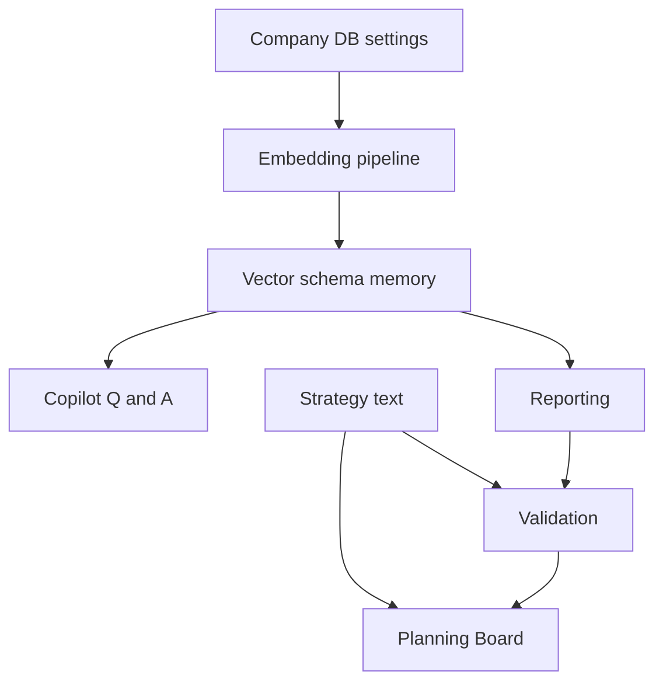

## Performance Considerations

- Long-running operations use Celery and Redis to avoid HTTP timeout pressure.
- Planning and validation workers use `worker_prefetch_multiplier=1` to reduce unfair task reservation.
- Planning has a 5 minute hard task time limit; validation has a 10 minute hard task time limit.
- Embedding batches table description generation using `INGESTION_CHUNK_SIZE`.
- Vector search narrows table candidates before schema retrieval and SQL generation.
- Reporting runs SQL into pandas once, then performs graph-based dataframe analysis.
- Validation uses `asyncio.gather` to parallelize independent company/report/structuring and engine phases.

## Security

Implemented controls visible in the repository:

- Copilot SQL execution only allows queries starting with `SELECT`.
- Copilot SQL execution blocks write and DDL keywords such as `INSERT`, `UPDATE`, `DELETE`, `DROP`, `ALTER`, `TRUNCATE`, `CREATE`, `GRANT`, `REVOKE`, and `REPLACE`.
- Copilot table selection intersects RBAC-allowed tables with vector-search results.
- Planning and validation use a service API key dependency.
- Secrets are intended to live in `.env` files, not code.
- CORS origins are configurable.
- Production docs can be hidden in services that check environment mode.

Security work that should be reviewed before production:

- Ensure source database credentials are read-only at the database-user level.
- Ensure `.env` files are never committed with real secrets.
- Add request-size and rate limits at the API gateway.
- Add structured audit logging around generated SQL and external API access.

## Scalability

The architecture supports horizontal scaling by separating APIs, workers, Redis, external databases, and LLM calls. API containers can scale independently from worker containers. Queue names isolate workloads per feature. PostgreSQL pgvector centralizes schema memory so multiple copilot or reporting replicas can share the same semantic index.

Practical scaling levers:

- Add more Celery workers per queue.
- Split Redis instances per service in production.
- Add pgvector indexes appropriate to the vector column and distance operator.
- Cache metadata and schema lookups for repeated company/team requests.
- Route heavy validation and reporting jobs to separate worker pools.

## Design Patterns Used

| Pattern | Where It Appears | Purpose |
| --- | --- | --- |
| Service Layer | `services/*` across all features | Keeps orchestration and business logic out of routes |
| Repository | metadata/source/vector repository modules | Encapsulates database access |
| Factory | `create_chat_service`, agent/task creation functions | Builds configured service or agent instances |
| Dependency Injection | FastAPI `Depends`, optional constructor dependencies | Injects auth checks and replaceable collaborators |
| Strategy-like Engine Composition | validation engines, planning role matching/fallback | Runs specialized algorithms behind stable service interfaces |
| Builder/Assembler | response builders in planning and validation | Converts internal entities into API DTOs |
| Pipeline | embedding, reporting, validation, planning orchestrators | Expresses staged workflows with clear inputs and outputs |
| Worker Queue | Celery task wrappers | Separates HTTP request handling from expensive work |

## Future Improvements

- Add a root-level compose file to orchestrate all services together.
- Add database migration scripts for `client_schema_vectors` and `team_assignment_audit`.
- Add OpenAPI examples exported into versioned documentation.
- Add integration tests with test Redis, test PostgreSQL/pgvector, and mocked LLM clients.
- Add SQL AST parsing for stronger query safety than keyword checks.
- Add streaming task progress through WebSockets or Server-Sent Events.
- Add centralized observability: structured logs, traces, metrics, task dashboards, and LLM cost tracking.
- Add shared packages for repeated Celery, settings, LLM, and response patterns.
- Rename `validition` to `validation` with backward-compatible deployment paths if external integrations allow it.

## Contributing

1. Open an issue describing the bug, feature, or documentation gap.
2. Keep changes scoped to one service unless a cross-service contract is being changed.
3. Add or update tests in the service-local `tests/` directory when behavior changes.
4. Use the existing service style: FastAPI routes delegate to service classes, workers wrap service orchestration, and DTOs live in `models` or `api/schemas.py`.
5. Do not commit real `.env` files, API keys, database credentials, generated caches, or local virtual environments.

## License

This project is licensed under the MIT License. See the [LICENSE](LICENSE) file for details.

## Authors

Hossam Taha

- LinkedIn: www.linkedin.com/in/hossam-taha-41b724288
- Facebook: https://web.facebook.com/hossam.elsrah17
- Email: hossamelsrah5@gmail.com

## Acknowledgments

This project uses FastAPI, Celery, Redis, CrewAI, LangGraph, SentenceTransformers, PostgreSQL/pgvector, SQL Server ODBC tooling, and OpenRouter-compatible LLM providers.
